# 🎟️ Live Seat Map Engine (Real-Time WebSocket)


Um motor de reserva de assentos de alta performance em tempo real. Este projeto demonstra o uso de **WebSockets** e **Redis** para gerenciar estados efêmeros e resolver condições de corrida (Race Conditions) em ambientes distribuídos.

---

## ⚡ O Desafio Técnico

Em sistemas de ingressos (como Ticketmaster ou cinema), o maior gargalo não é a compra final, mas o **bloqueio temporário (Hold)**.

1.  **Concorrência Extrema**: Múltiplos usuários clicam no mesmo assento no mesmo milissegundo.
2.  **Feedback Visual**: O estado precisa ser propagado em <50ms.
3.  **Estado Efêmero**: Se o usuário desconecta, o assento deve ser liberado instantaneamente.

**Solução:** Uma arquitetura baseada em eventos onde o **Redis** atua como a "Fonte da Verdade" (Single Source of Truth) para o estado temporário e o **Socket.io** gerencia o broadcast via Redis Adapter para escalabilidade horizontal.

---

## 🏗️ Arquitetura

```mermaid
sequenceDiagram
    participant Client A
    participant Client B
    participant Server as Node.js Cluster
    participant Redis as Redis (Pub/Sub + Storage)

    Client A->>Server: 🎫 Request Seat (A1)
    
    rect rgb(20, 20, 20)
        note right of Server: Atomic Check (SET NX)
        Server->>Redis: SET seat:A1 "UserA" NX EX 300
        Redis-->>Server: OK (Success)
    end

    par Broadcast
        Server->>Client A: ✅ Seat Locked (You)
        Server->>Client B: 🚫 Seat A1 Taken (Red)
    end

    Client B->>Server: 🎫 Request Seat (A1)
    Server->>Redis: SET seat:A1 "UserB" NX EX 300
    Redis-->>Server: NULL (Fail)
    Server->>Client B: ❌ Error: Already Reserved
```



### Decisões de Engenharia

1.  **Concorrência Pessimista Atômica**: Utilizamos `SET resource_id user_id NX EX 300`. A flag `NX` (Not Exists) garante que o Redis só aceite a escrita se a chave não existir. Isso é atômico e elimina Race Conditions sem precisar de locks complexos.
2.  **Tratamento de Desconexões**: Um Set no Redis mapeia `socket_id -> [seats]`. No evento `disconnect`, o servidor apaga as chaves desse socket, liberando os assentos imediatamente.

---

## 🚀 Como Rodar Localmente

### Pré-requisitos
- Docker e Docker Compose.
- Node.js 18+.

### Passos

1.  **Clone o repositório**
    ```bash
    git clone https://github.com/seu-usuario/live-seat-map-engine.git
    cd live-seat-map-engine
    ```

2.  **Suba a Infraestrutura (Redis)**
    ```bash
    # Na pasta docker-servers ou onde estiver seu docker-compose
    docker compose up -d redis
    ```

3.  **Instale e Rode**
    ```bash
    npm install
    npm run dev
    ```

4.  **Teste**: Abra `http://localhost:3000` em duas janelas anônimas.

---

## 🧪 Testes

O projeto conta com validação estática via ESLint e testes manuais de concorrência.

```bash
# Linting
npm run lint
```