```mermaid
sequenceDiagram
    participant Client
    participant Controller
    participant Service
    participant Redis

    Client->>Controller: emit("request_seat", { seatId: "A1" })
    
    rect rgb(20, 20, 20)
        note right of Controller: 1. Rate Limit Check
        Controller->>Redis: INCR rate:limit:user:123
        Redis-->>Controller: Count <= 5
        
        note right of Controller: 2. Atomic Reservation
        Controller->>Service: reserveSeat("A1")
        Service->>Redis: SET seat:A1 "User123" NX EX 300
        
        alt Lock Acquired (Success)
            Redis-->>Service: OK
            Service->>Controller: true
            Controller->>Client: broadcast("seat_locked", "A1")
        else Lock Failed (Already Taken)
            Redis-->>Service: null
            Service->>Controller: false
            Controller->>Client: emit("error", "Seat taken")
        end
    end
```

# Live Seat Map Engine


**[🇧🇷 Leia em Português](README_pt-br.md)**

High-performance real-time seat reservation system demonstrating **Atomic Locking**, **Strict Concurrency Control**, and **Distributed State Management** using Node.js and Redis.

---

## 🔒 Atomic Locking Flow (Race Condition Proof)



---

## 🏗 Why this exists?

Real-time inventory systems (Tickets, Cinemas, Airlines) face significant challenges:
1.  **Race Conditions:** Two users booking the same seat simultaneously.
2.  **Zombie Locks:** Users selecting seats and closing the browser without purchasing.
3.  **Scale:** Broadcasting changes to thousands of connected clients instantly.

This project solves these problems using **Redis Atomic Operations** for locking and **Socket.io** for efficient state propagation.

---

## 🚀 Key Features

### 1. Atomic Locking (`SET NX`)
Eliminates race conditions by using Redis's native atomic `SET ... NX` command.
- *Result:* No complex software-level mutexes are needed. The database enforces uniqueness at the lowest level.

### 2. Zero Zombie Reservations
Implements a "Lease" mechanism (TTL) and Disconnect Listeners.
- If a user closes the tab, the socket disconnection handler immediately triggers a cleanup, releasing all locks held by that session.
- If the server crashes, Redis keys expire automatically after 5 minutes (TTL).

### 3. Rate Limiting Protection
Prevents abuse (e.g., a bot script trying to lock the entire theater).
- Implemented via a "Token Bucket" style algorithm using Redis counters.
- Limit: 5 seat requests per minute per user.

---

## 🛠 Tech Stack

- **Runtime:** Node.js 20+ (TypeScript Strict Mode)
- **Real-time:** Socket.io (with Redis Adapter for Horizontal Scaling)
- **State/Locking:** Redis (ioredis)
- **Validation:** Zod
- **Testing:** Jest + ts-jest
- **Observability:** Winston (Structured JSON Logging)

---

## ⚡ Quick Start

### 1. Start Infrastructure
Ensure you have a Redis instance running locally or remotely.
```bash
# Start Redis on default port 6379
redis-server
```

### 2. Install Dependencies
```bash
npm install
```

### 3. Run Locally
```bash
npm run dev
# Open http://localhost:3000 in multiple tabs to test concurrency
```

### 4. Run Tests
```bash
npm test
```

---

## 👨‍💻 Author

**Gérson Resplandes**
Backend Engineer focused on High-Concurrency & Real-Time Systems.

[](https://www.linkedin.com/in/gerson-resplandes)
[](mailto:maiorgerson@gmail.com)