# Live Seat Map Engine


**[🇺🇸 Read in English](README.md)**

Sistema de reserva de assentos em tempo real e alta performance, demonstrando **Travamento Atômico**, **Controle Estrito de Concorrência** e **Gerenciamento de Estado Distribuído** usando Node.js e Redis.

---

## 🔒 Fluxo de Travamento Atômico (Prova de Race Condition)

```mermaid
sequenceDiagram
    participant Client
    participant Controller
    participant Service
    participant Redis

    Client->>Controller: emit("request_seat", { seatId: "A1" })
    
    rect rgb(20, 20, 20)
        note right of Controller: 1. Checagem de Rate Limit
        Controller->>Redis: INCR rate:limit:user:123
        Redis-->>Controller: Count <= 5
        
        note right of Controller: 2. Reserva Atômica
        Controller->>Service: reserveSeat("A1")
        Service->>Redis: SET seat:A1 "User123" NX EX 300
        
        alt Lock Adquirido (Sucesso)
            Redis-->>Service: OK
            Service->>Controller: true
            Controller->>Client: broadcast("seat_locked", "A1")
        else Lock Falhou (Já Ocupado)
            Redis-->>Service: null
            Service->>Controller: false
            Controller->>Client: emit("error", "Assento ocupado")
        end
    end
```



---

## 🏗 Por que isso existe?

Sistemas de inventário em tempo real (Ingressos, Cinemas, Passagens Aéreas) enfrentam desafios significativos:
1.  **Race Conditions:** Dois usuários reservando o mesmo assento simultaneamente.
2.  **Travamentos Zumbis:** Usuários selecionando assentos e fechando o navegador sem comprar.
3.  **Escala:** Broadcast de mudanças para milhares de clientes conectados instantaneamente.

Este projeto resolve esses problemas usando **Operações Atômicas do Redis** para travamento e **Socket.io** para propagação eficiente de estado.

---

## 🚀 Principais Funcionalidades

### 1. Travamento Atômico (`SET NX`)
Elimina race conditions usando o comando nativo atômico `SET ... NX` do Redis.
- *Resultado:* Não são necessários mutexes complexos em nível de software. O banco de dados garante a unicidade no nível mais baixo.

### 2. Zero Reservas Zumbis
Implementa um mecanismo de "Lease" (TTL) e Listeners de Desconexão.
- Se um usuário fecha a aba, o handler de desconexão do socket aciona imediatamente uma limpeza, liberando todos os bloqueios mantidos por aquela sessão.
- Se o servidor cair, as chaves do Redis expiram automaticamente após 5 minutos (TTL).

### 3. Proteção de Rate Limiting
Previne abuso (ex: um script bot tentando bloquear o teatro inteiro).
- Implementado via algoritmo estilo "Token Bucket" usando contadores Redis.
- Limite: 5 requisições de assento por minuto por usuário.

---

## 🛠 Tech Stack

- **Runtime:** Node.js 20+ (TypeScript Strict Mode)
- **Real-time:** Socket.io (com Redis Adapter para Escala Horizontal)
- **Estado/Locking:** Redis (ioredis)
- **Validação:** Zod
- **Testes:** Jest + ts-jest
- **Observabilidade:** Winston (Logs Estruturados em JSON)

---

## ⚡ Quick Start

### 1. Iniciar Infraestrutura
Certifique-se de ter uma instância Redis rodando localmente ou remotamente.
```bash
# Iniciar Redis na porta padrão 6379
redis-server
```

### 2. Instalar Dependências
```bash
npm install
```

### 3. Rodar Localmente
```bash
npm run dev
# Abra http://localhost:3000 em múltiplas abas para testar concorrência
```

### 4. Rodar Testes
```bash
npm test
```

---

## 👨‍💻 Autor

**Gérson Resplandes**
Engenheiro Backend focado em Alta Concorrência & Sistemas em Tempo Real.

[](https://www.linkedin.com/in/gerson-resplandes)
[](mailto:maiorgerson@gmail.com)
